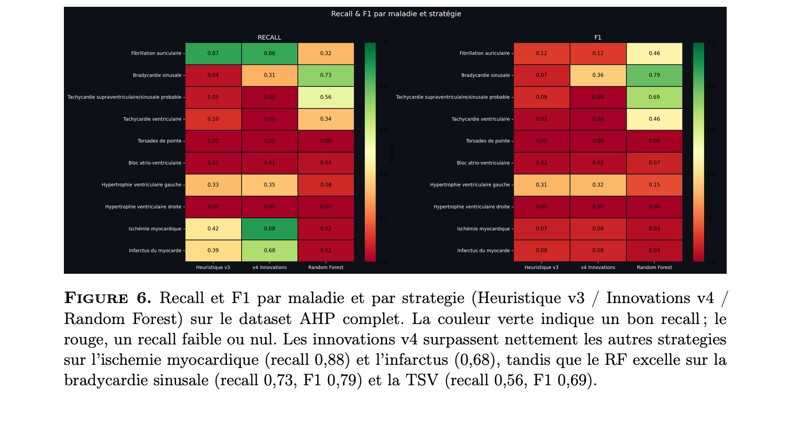
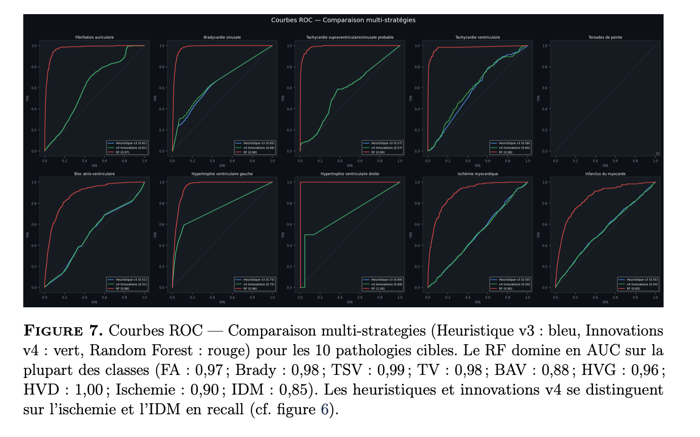
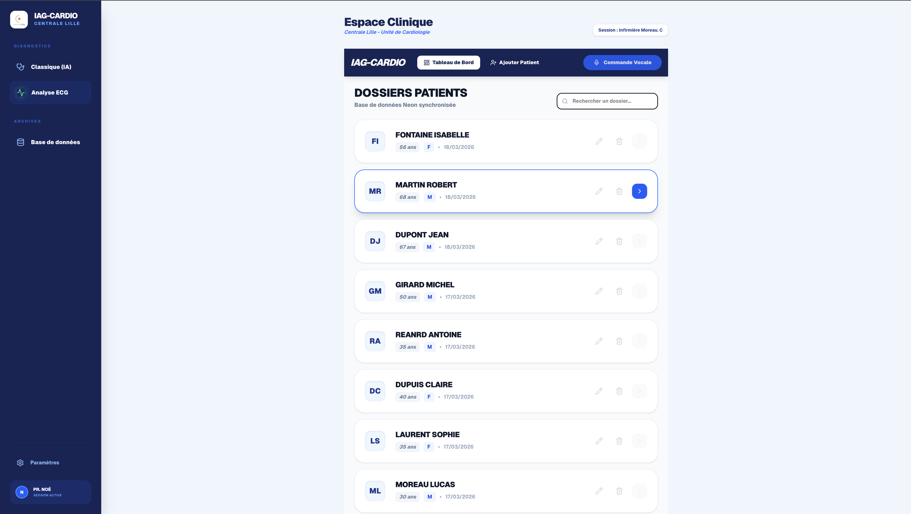
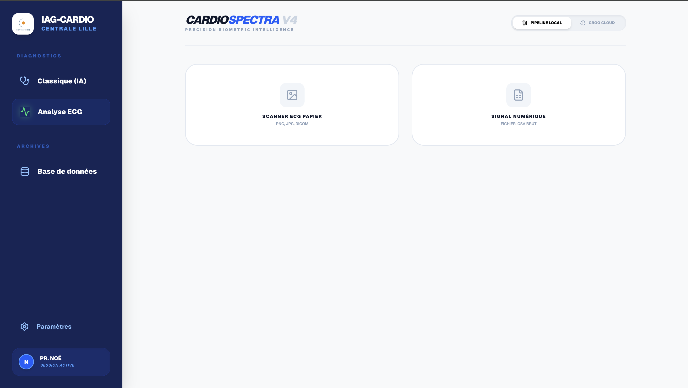
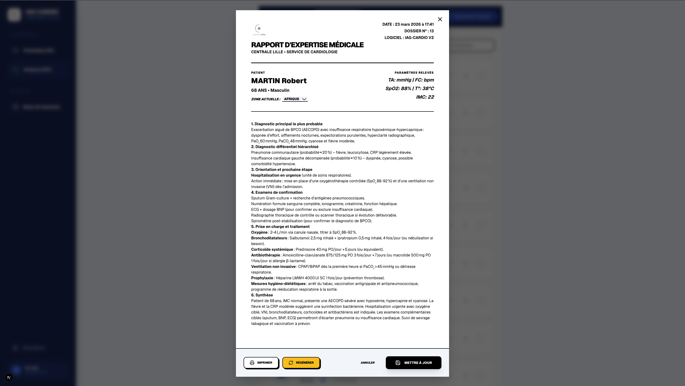
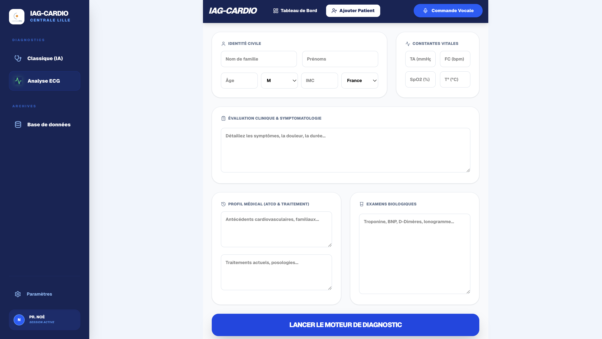

  

<h1 align="center">🫀 IAG-Cardio & Cardio-Spectra v4</h1>

  <strong>Intelligence Artificielle Médicale : Diagnostic Cardiaque en Temps Réel pour Zones Médicalement Isolées.</strong>

  
  
  
  

---

### 🌟 Vision du Projet
Développé en collaboration avec **STaR-AI**, ce projet vise à briser les barrières géographiques de l'accès aux soins. **IAG-Cardio** permet de détecter des crises cardiaques en temps réel, sans cardiologue sur place, spécifiquement conçu pour les zones rurales (notamment en Afrique).

---

## 📸 Aperçu & Validation Scientifique

> **Explicabilité (XAI) :** Une IA médicale ne peut être adoptée sans être comprise. Nous utilisons **SHAP** pour expliquer chaque décision de l'IA et garantir une confiance totale des praticiens.

### 📊 Performances & Métriques d'IA
| Matrice de Confusion (r1) | F1-Score & Rappel (r2) |
|:---:|:---:|
|  |  |
| *Validation de la précision des diagnostics* | *Métriques de performance par classe de pathologie* |

### 📱 Interface Application (Dashboard & Vocal)
| Dashboard Principal (d1) | Analyse ECG (d2) | Détails Diagnostic (d3) |
|:---:|:---:|:---:|
|  |  |  |

| Entrée Vocale (v1) |
|:---:|
|  |
| *Saisie assistée par dictée vocale pour les infirmiers* |

---

## 🚀 Deux Solutions Complémentaires
1.  **IAG-Cardio :** Interface de diagnostic génératif où un infirmier dicte les symptômes vocalement pour obtenir une analyse complète basée sur **LLaMA 3.3**.
2.  **Cardio-Spectra v4 :** Pipeline d'analyse d'ECG 12 dérivations capable de détecter **10 pathologies cardiaques** distinctes avec un **AUC de 0.99**.

## 🛠️ Stack Technologique High-End
* **LLM :** LLaMA 3.3 + GPT-OSS (Diagnostic génératif).
* **Machine Learning :** Random Forest calibré pour la classification ECG.
* **XAI :** SHAP (Shapley Additive Explanations) pour l'interprétabilité.
* **Web :** Next.js / NeonDB (Production-ready).

---

## 👥 L'Équipe (Centrale Lille - M2 MIAS)
Projet réalisé avec rigueur par :
* **Edouard Lansiaux**
* **Aurelien Loison**
* **Hugo Kazzi**
* **Guillaume Gauguet**
* **Abdallah Imad LAFENDI**

---

## ⚖️ Propriété Intellectuelle & Confidentialité

Copyright © 2026 **Projet IAG-Cardio / Centrale Lille / STaR-AI**.

Ce dépôt est une **présentation publique**. Le code source, les modèles pré-entraînés et les datasets médicaux sont strictement confidentiels et protégés par les accords de partenariat avec STaR-AI. Toute reproduction est interdite.

---
**Contact :** [lafendiabdallahimad@gmail.com] | [https://www.linkedin.com/in/abdallah-imad-lafendi-476803326/]
